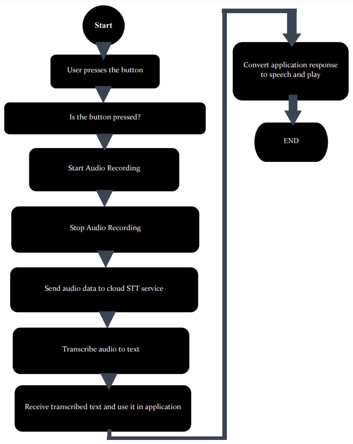
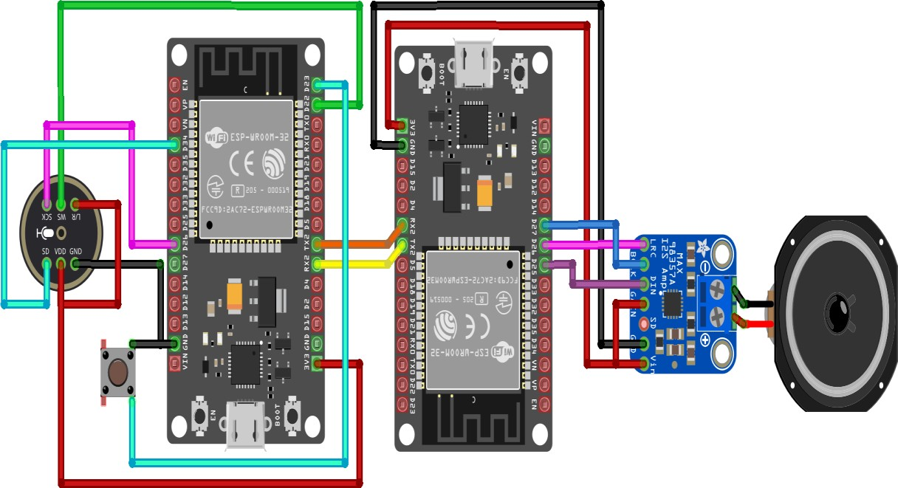

# AI-Waifu Voice Assistant

## Project Overview
AI-Waifu is an IoT-based voice assistant designed as Task 2 for the ECL-108 IoT Workshop 2. The project employs two ESP32 DevKit boards communicating via UART to capture and process voice input, then produce synthesized speech output. It utilizes a MEMS microphone (INMP441) and an I2S audio amplifier (MAX98357A) for audio input and output, respectively. The Google Text-to-Speech (TTS) API generates responses with a Japanese female voice.

## Key Features
- **Real-time Speech Recognition:** Captures audio from a MEMS microphone and converts it to text.
- **Speech Synthesis:** Outputs natural-sounding speech through a speaker using an I2S audio amplifier.
- **Dual ESP32 Communication:** Coordinates tasks between two ESP32 boards over UART.
- **I2S Protocol:** Ensures high-fidelity audio transfer for both input and output.

---

## Hardware Components
- **2 × ESP32 DevKit Boards**
- **INMP441 MEMS Microphone:** I2S-based, digital MEMS microphone.
- **MAX98357A Audio Amplifier:** I2S-based audio amplifier.
- **Speaker:** Connected to the MAX98357A.
- **UART Communication Cables**
- **Jumper Wires**

---

## System Architecture

1. **Audio Capture and Processing (ESP32 #1):**  
   - Captures real-time audio input via the INMP441 microphone.
   - Uses the I2S protocol to convert analog signals into digital data.
   - Transmits the converted text data to the second ESP32 using UART.

2. **Text-to-Speech and Output (ESP32 #2):**  
   - Receives text data through UART.
   - Sends the text to the Google TTS API to generate audio output.
   - Plays the synthesized speech through the speaker using the MAX98357A amplifier.

---

## Folder Structure
```
ai-waifu/
├── ChatGPT Voice Assistant/
│   ├── ESP32_Speech_to_Text_t/
│   │   ├── Audio.cpp
│   │   ├── Audio.h
│   │   ├── CloudSpeechClient.cpp
│   │   ├── CloudSpeechClient.h
│   │   ├── ESP32_Speech_to_Text_t.ino
│   │   ├── I2S.cpp
│   │   ├── I2S.h
│   │   ├── network_param.h
│   ├── ESP32_Text_to_Speech/
│   │   ├── ESP32_Text_to_Speech.ino
├── ckt.png
├── flowchart.png
├── w2t2.pdf
```

---

## Hardware Setup

### 1. **INMP441 MEMS Microphone Connections (ESP32 #1):**
| **INMP441 Pin** | **ESP32 Pin** |
|-----------------|---------------|
| VCC             | 3.3V          |
| GND             | GND           |
| WS              | IO15          |
| SCK             | IO14          |
| SD              | IO32          |

### 2. **MAX98357A Amplifier Connections (ESP32 #2):**
| **MAX98357A Pin** | **ESP32 Pin** |
|-------------------|---------------|
| VIN               | 3.3V          |
| GND               | GND           |
| BCK               | IO27          |
| LRCK              | IO25          |
| DIN               | IO26          |

### 3. **UART Connections between ESP32 Boards:**
| **ESP32 #1 Pin** | **ESP32 #2 Pin** |
|------------------|------------------|
| TX (IO17)        | RX (IO16)        |
| RX (IO16)        | TX (IO17)        |
| GND              | GND              |

---

## Software Setup

### 1. **Prerequisites:**
- Install [Arduino IDE](https://www.arduino.cc/en/software).
- Add [ESP32 board support](https://randomnerdtutorials.com/installing-the-esp32-board-in-arduino-ide-windows-instructions/).
- Obtain a [Google Cloud TTS API Key](https://cloud.google.com/text-to-speech/docs/quickstart-client-libraries).

### 2. **Code Deployment:**
1. **Speech-to-Text (ESP32 #1):**  
   Upload `ESP32_Speech_to_Text_t.ino` to the first ESP32.
2. **Text-to-Speech (ESP32 #2):**  
   Upload `ESP32_Text_to_Speech.ino` to the second ESP32.

### 3. **Configure Network Parameters:**
- Edit `network_param.h`:
  ```cpp
  #define WIFI_SSID "your_wifi_ssid"
  #define WIFI_PASSWORD "your_wifi_password"
  #define API_KEY "your_google_tts_api_key"
  ```

---

## Flowchart
<p align="center">
  
</p>

---

## Circuit Diagram


---

## Code Explanation

### **ESP32_Speech_to_Text_t.ino:**
- Initializes the I2S interface for the INMP441 microphone.
- Captures audio and sends it for cloud-based speech recognition.
- Transmits recognized text data over UART.

### **ESP32_Text_to_Speech.ino:**
- Receives text data from UART.
- Requests speech synthesis from Google TTS API.
- Outputs the received audio stream through MAX98357A using I2S.

---

## Troubleshooting

1. **No Audio Input Detection:**
   - Verify microphone connections.
   - Check I2S pin configuration in `I2S.cpp`.

2. **UART Communication Failure:**
   - Ensure both boards have matching baud rates.
   - Confirm TX/RX connections.
   - Avoid connecting GND pins of both ESP32 Devkit boards together.

3. **Google TTS Errors:**
   - Validate your API key.
   - Check internet connectivity.

---

## Demo Video
Check out the project in action: [AI-Waifu Demo on LinkedIn](https://www.linkedin.com/posts/jjateen_ai-iot-aiot-activity-7108889698843955200-Yjcg?utm_source=share&utm_medium=member_desktop)

---

## Future Enhancements
- Support for additional languages and voices.
- Integration with more advanced NLP models for contextual responses.

---
